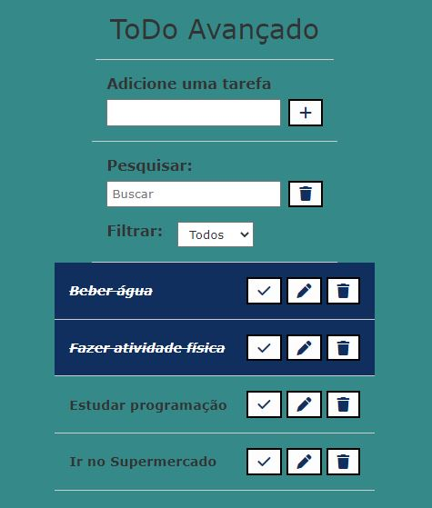

# Lista de Tarefas

<p align="center">
  
</p>

# Sobre o Projeto

#### 

Lista de tarefas para organização das atividades diárias. Pode-se marcar como concluída, editar e excluir as tarefas.
Modo de filtro e pesquisa ainda em fase de implementação.

Projeto tem como objetivo praticar linguagem JavaScript, HTML e CSS.

<h4>
  
## Link do projeto

#### https://lista-de-tarefas-ol8.netlify.app

# Tecnologias utilizadas
  
## Front end
- Javascript 
- CSS
- HTML
  
## Implementação em produção
- Front end web: Netlify
  
# Como executar o projeto

## Front end
Pré-requisitos: npm / yarn

```bash
# clonar repositório
  
git clone https://github.com/OseiasLissak/TodoAvancado.git

# entrar na pasta do projeto ToDoAvancado
cd ToDoAvancado


# instalar dependências
yarn install

# executar o projeto
yarn start
```  
  
# Autor
  
Oseias Lissak dos Santos
  
www.linkedin.com/in/oseiaslissak


